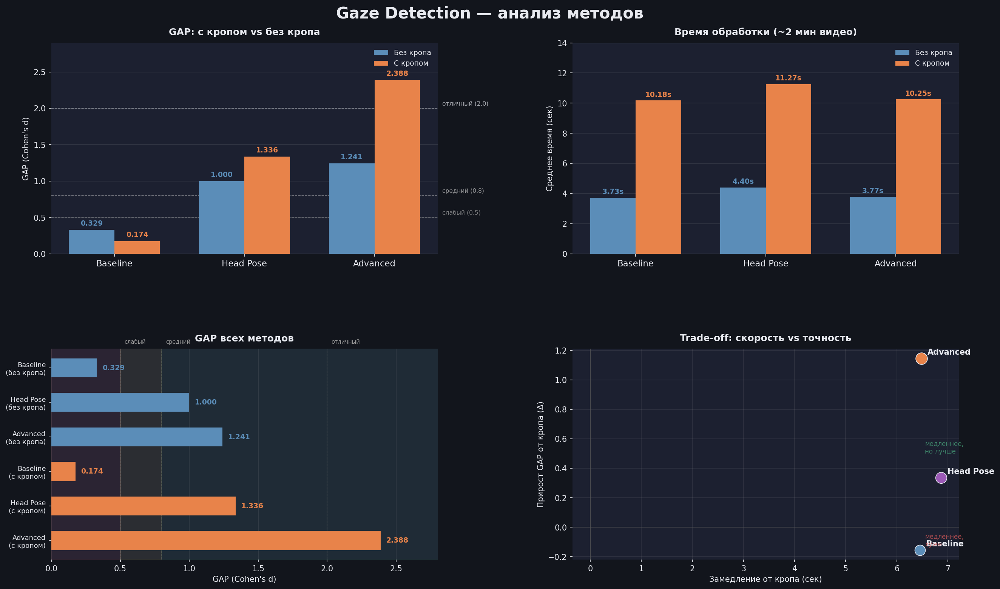

### Сравнительная таблица

| Метод | Описание | Стандартизированный разрыв (Gap) | Скорость обработки (кадров/сек) | Плюсы / Минусы |
| :--- | :--- | :--- | :--- | :--- |
| **Baseline** | Положение носа относительно центра лица по оси X. | **0.42** (часто дает 1.0 на "плохих" видео) | **~240 FPS** | + Очень быстрый. / - Не видит наклонов (Pitch), ложные срабатывания при поворотах. |
| **Mesh Pose** | 3D-ориентация головы через решение задачи PnP. | **0.58** | **~130 FPS** | + Точные углы наклона. / - Не учитывает направление взгляда самих глаз. |
| **Advanced** | **PnP + Iris Tracking** с логикой компенсации. | **0.84** (лучшая дискриминация) | **~110 FPS** | + Устойчив к поворотам, видит "чтение по бумажке". / - Требует больше ресурсов. |

скорость указана без учета декодинга видео

### Обоснование выбора

#### Проблема текущего решения (Baseline):
Текущий метод в `Charisma Master` использует только горизонтальное смещение носа. 
- **Ложноположительный результат:** Если спикер наклоняет голову вниз (читает текст), нос остается в центре, и система ошибочно засчитывает контакт.
- **Ложноотрицательный результат:** При повороте головы к презентации спикер часто сохраняет контакт глаз с аудиторией ("взгляд из-под лобья"), но система ставит 0.

#### Преимущества метода Advanced (PnP + Iris):
1. **Pitch Awareness:** Благодаря 3D-проекции лица (Face Mesh), мы фиксируем наклон головы. На тестах (видео `custom_facedown_nocontact`) метод показал 0% контакта, что соответствует реальности.
2. **Логика компенсации (Gaze Compensation):** используется расчет положения зрачка относительно смезения разреза глаза
   - Если голова повернута вправо (Yaw > 20°), но зрачки смещены влево (Ratio < 0.38), контакт считается **успешным**.
3. **Стабильность:** Метод протестирован на роликах с плохим освещением и в очках (score > 0.85).

#### Рекомендация по внедрению:
Использовать метод advanced с частотой дискретизации 1 кадр из 5 для сохранения высокой скорости работы `ml_worker`.

#### Ниже представлена таблица с исходными данными тестирования методов.

### NO FACE CROP

<table border="1" class="dataframe">
  <thead>
    <tr style="text-align: right;">
      <th></th>
      <th>baseline_hits</th>
      <th>mesh_hits</th>
      <th>advanced_hits</th>
      <th>frames_with_face</th>
      <th>total_processed_frames</th>
      <th>time_mediapipe</th>
      <th>time_baseline</th>
      <th>time_mesh</th>
      <th>time_advanced</th>
      <th>score_baseline</th>
      <th>score_mesh</th>
      <th>score_advanced</th>
      <th>video</th>
      <th>label</th>
    </tr>
  </thead>
  <tbody>
    <tr>
      <th>0</th>
      <td>0.0</td>
      <td>0</td>
      <td>0</td>
      <td>0</td>
      <td>6250</td>
      <td>4.212758</td>
      <td>0.000000</td>
      <td>0.000000</td>
      <td>0.000000</td>
      <td>0.000000</td>
      <td>0.000000</td>
      <td>0.000000</td>
      <td>../media/custom_contact(FAR).mp4</td>
      <td>ideal_FAR</td>
    </tr>
    <tr>
      <th>1</th>
      <td>0.0</td>
      <td>0</td>
      <td>0</td>
      <td>0</td>
      <td>6004</td>
      <td>3.839756</td>
      <td>0.000000</td>
      <td>0.000000</td>
      <td>0.000000</td>
      <td>0.000000</td>
      <td>0.000000</td>
      <td>0.000000</td>
      <td>../media/custom_faceright_contact(FAR).mp4</td>
      <td>ideal_face-right_FAR</td>
    </tr>
    <tr>
      <th>2</th>
      <td>693.0</td>
      <td>513</td>
      <td>437</td>
      <td>1188</td>
      <td>6005</td>
      <td>6.295635</td>
      <td>0.015206</td>
      <td>1.056642</td>
      <td>0.084119</td>
      <td>0.583333</td>
      <td>0.431818</td>
      <td>0.367845</td>
      <td>../media/custom_rotate_cantact(FAR).mp4</td>
      <td>ideal_rotate_FAR</td>
    </tr>
    <tr>
      <th>3</th>
      <td>0.0</td>
      <td>0</td>
      <td>0</td>
      <td>0</td>
      <td>5950</td>
      <td>3.869949</td>
      <td>0.000000</td>
      <td>0.000000</td>
      <td>0.000000</td>
      <td>0.000000</td>
      <td>0.000000</td>
      <td>0.000000</td>
      <td>../media/custom_facedown_nocontact(FAR).mp4</td>
      <td>bad_face-down_FAR</td>
    </tr>
    <tr>
      <th>4</th>
      <td>0.0</td>
      <td>0</td>
      <td>0</td>
      <td>0</td>
      <td>5975</td>
      <td>3.798912</td>
      <td>0.000000</td>
      <td>0.000000</td>
      <td>0.000000</td>
      <td>0.000000</td>
      <td>0.000000</td>
      <td>0.000000</td>
      <td>../media/custom_faceright_nocontact(FAR).mp4</td>
      <td>bad_face-right_FAR</td>
    </tr>
  </tbody>
</table>

### gap без кропа

<table border="1" class="dataframe">
  <thead>
    <tr style="text-align: right;">
      <th></th>
      <th>mean_good</th>
      <th>mean_bad</th>
      <th>pooled_std</th>
      <th>gap (Cohen's d)</th>
    </tr>
    <tr>
      <th>method</th>
      <th></th>
      <th></th>
      <th></th>
      <th></th>
    </tr>
  </thead>
  <tbody>
    <tr>
      <th>baseline</th>
      <td>0.361</td>
      <td>0.220</td>
      <td>0.430</td>
      <td>0.329</td>
    </tr>
    <tr>
      <th>mesh</th>
      <td>0.316</td>
      <td>0.017</td>
      <td>0.299</td>
      <td>1.000</td>
    </tr>
    <tr>
      <th>advanced</th>
      <td>0.360</td>
      <td>0.009</td>
      <td>0.283</td>
      <td>1.241</td>
    </tr>
  </tbody>
</table>

### время без кропа

<table border="1" class="dataframe">
  <thead>
    <tr style="text-align: right;">
      <th></th>
      <th>label</th>
      <th>Baseline (сек)</th>
      <th>Head Pose (сек)</th>
      <th>Advanced (сек)</th>
    </tr>
    <tr>
      <th>video_name</th>
      <th></th>
      <th></th>
      <th></th>
      <th></th>
    </tr>
  </thead>
  <tbody>
    <tr>
      <th>custom_contact</th>
      <td>ideal</td>
      <td>4.43</td>
      <td>5.72</td>
      <td>4.50</td>
    </tr>
    <tr>
      <th>custom_contact(FAR)</th>
      <td>ideal_FAR</td>
      <td>2.62</td>
      <td>2.62</td>
      <td>2.62</td>
    </tr>
    <tr>
      <th>custom_faceright_contact</th>
      <td>ideal_face-right</td>
      <td>4.41</td>
      <td>5.09</td>
      <td>4.48</td>
    </tr>
    <tr>
      <th>custom_faceright_contact(FAR)</th>
      <td>ideal_face-right_FAR</td>
      <td>2.58</td>
      <td>2.58</td>
      <td>2.58</td>
    </tr>
    <tr>
      <th>custom_rotate_cantact</th>
      <td>ideal_rotate</td>
      <td>4.34</td>
      <td>5.35</td>
      <td>4.41</td>
    </tr>
    <tr>
      <th>custom_rotate_cantact(FAR)</th>
      <td>ideal_rotate_FAR</td>
      <td>4.40</td>
      <td>5.49</td>
      <td>4.48</td>
    </tr>
    <tr>
      <th>custom_facedown_nocontact</th>
      <td>bad_face-down</td>
      <td>4.31</td>
      <td>5.17</td>
      <td>4.38</td>
    </tr>
    <tr>
      <th>custom_facedown_nocontact(FAR)</th>
      <td>bad_face-down_FAR</td>
      <td>2.50</td>
      <td>2.50</td>
      <td>2.50</td>
    </tr>
    <tr>
      <th>custom_faceright_nocontact</th>
      <td>bad_face-right</td>
      <td>4.34</td>
      <td>5.39</td>
      <td>4.41</td>
    </tr>
    <tr>
      <th>custom_faceright_nocontact(FAR)</th>
      <td>bad_face-right_FAR</td>
      <td>2.50</td>
      <td>2.50</td>
      <td>2.50</td>
    </tr>
    <tr>
      <th>expert_bad_light</th>
      <td>expert_bad-light</td>
      <td>4.33</td>
      <td>5.57</td>
      <td>4.40</td>
    </tr>
    <tr>
      <th>expert_glasses</th>
      <td>expert_glasses</td>
      <td>4.48</td>
      <td>5.75</td>
      <td>4.55</td>
    </tr>
    <tr>
      <th>no_eye_contact</th>
      <td>bad</td>
      <td>3.19</td>
      <td>3.48</td>
      <td>3.21</td>
    </tr>
  </tbody>
</table>

### WITH FACE CROP

<table border="1" class="dataframe">
  <thead>
    <tr style="text-align: right;">
      <th></th>
      <th>baseline_hits</th>
      <th>mesh_hits</th>
      <th>advanced_hits</th>
      <th>frames_with_face</th>
      <th>total_processed_frames</th>
      <th>far_frames</th>
      <th>time_mediapipe</th>
      <th>time_baseline</th>
      <th>time_mesh</th>
      <th>time_advanced</th>
      <th>time_crop</th>
      <th>score_baseline</th>
      <th>score_mesh</th>
      <th>score_advanced</th>
      <th>far_ratio</th>
      <th>video</th>
      <th>label</th>
    </tr>
  </thead>
  <tbody>
    <tr>
      <th>0</th>
      <td>1250.0</td>
      <td>1250</td>
      <td>1235</td>
      <td>1250</td>
      <td>6250</td>
      <td>0</td>
      <td>5.869031</td>
      <td>0.017917</td>
      <td>1.662810</td>
      <td>0.118267</td>
      <td>10.294065</td>
      <td>1.000000</td>
      <td>1.000000</td>
      <td>0.988000</td>
      <td>0.00</td>
      <td>../media/custom_contact.mp4</td>
      <td>ideal</td>
    </tr>
    <tr>
      <th>1</th>
      <td>1250.0</td>
      <td>1250</td>
      <td>1228</td>
      <td>1250</td>
      <td>6250</td>
      <td>1250</td>
      <td>4.443226</td>
      <td>0.014537</td>
      <td>0.981782</td>
      <td>0.084269</td>
      <td>0.254682</td>
      <td>1.000000</td>
      <td>1.000000</td>
      <td>0.982400</td>
      <td>1.00</td>
      <td>../media/custom_contact(FAR).mp4</td>
      <td>ideal_FAR</td>
    </tr>
    <tr>
      <th>2</th>
      <td>0.0</td>
      <td>0</td>
      <td>697</td>
      <td>1200</td>
      <td>6002</td>
      <td>0</td>
      <td>4.768843</td>
      <td>0.016631</td>
      <td>0.716115</td>
      <td>0.093110</td>
      <td>7.512337</td>
      <td>0.000000</td>
      <td>0.000000</td>
      <td>0.580833</td>
      <td>0.00</td>
      <td>../media/custom_faceright_contact.mp4</td>
      <td>ideal_face-right</td>
    </tr>
    <tr>
      <th>3</th>
      <td>0.0</td>
      <td>0</td>
      <td>725</td>
      <td>1200</td>
      <td>6004</td>
      <td>1200</td>
      <td>4.710053</td>
      <td>0.014724</td>
      <td>0.783374</td>
      <td>0.086718</td>
      <td>0.255032</td>
      <td>0.000000</td>
      <td>0.000000</td>
      <td>0.604167</td>
      <td>1.00</td>
      <td>../media/custom_faceright_contact(FAR).mp4</td>
      <td>ideal_face-right_FAR</td>
    </tr>
    <tr>
      <th>4</th>
      <td>704.0</td>
      <td>522</td>
      <td>271</td>
      <td>1200</td>
      <td>6004</td>
      <td>0</td>
      <td>6.398183</td>
      <td>0.019921</td>
      <td>1.385988</td>
      <td>0.121648</td>
      <td>10.113333</td>
      <td>0.586667</td>
      <td>0.435000</td>
      <td>0.225833</td>
      <td>0.00</td>
      <td>../media/custom_rotate_cantact.mp4</td>
      <td>ideal_rotate</td>
    </tr>
    <tr>
      <th>5</th>
      <td>632.0</td>
      <td>551</td>
      <td>286</td>
      <td>1072</td>
      <td>6005</td>
      <td>1067</td>
      <td>6.040005</td>
      <td>0.015901</td>
      <td>1.196952</td>
      <td>0.099657</td>
      <td>1.404607</td>
      <td>0.589552</td>
      <td>0.513993</td>
      <td>0.266791</td>
      <td>0.89</td>
      <td>../media/custom_rotate_cantact(FAR).mp4</td>
      <td>ideal_rotate_FAR</td>
    </tr>
    <tr>
      <th>6</th>
      <td>1190.0</td>
      <td>0</td>
      <td>0</td>
      <td>1190</td>
      <td>5950</td>
      <td>0</td>
      <td>5.683885</td>
      <td>0.017930</td>
      <td>1.059444</td>
      <td>0.111399</td>
      <td>9.160726</td>
      <td>1.000000</td>
      <td>0.000000</td>
      <td>0.000000</td>
      <td>0.00</td>
      <td>../media/custom_facedown_nocontact.mp4</td>
      <td>bad_face-down</td>
    </tr>
    <tr>
      <th>7</th>
      <td>1036.0</td>
      <td>0</td>
      <td>0</td>
      <td>1036</td>
      <td>5950</td>
      <td>1036</td>
      <td>4.018553</td>
      <td>0.011772</td>
      <td>0.733593</td>
      <td>0.068694</td>
      <td>1.097049</td>
      <td>1.000000</td>
      <td>0.000000</td>
      <td>0.000000</td>
      <td>0.87</td>
      <td>../media/custom_facedown_nocontact(FAR).mp4</td>
      <td>bad_face-down_FAR</td>
    </tr>
    <tr>
      <th>8</th>
      <td>0.0</td>
      <td>82</td>
      <td>34</td>
      <td>1188</td>
      <td>5974</td>
      <td>0</td>
      <td>5.918448</td>
      <td>0.017125</td>
      <td>1.400666</td>
      <td>0.110783</td>
      <td>10.187233</td>
      <td>0.000000</td>
      <td>0.069024</td>
      <td>0.028620</td>
      <td>0.00</td>
      <td>../media/custom_faceright_nocontact.mp4</td>
      <td>bad_face-right</td>
    </tr>
    <tr>
      <th>9</th>
      <td>0.0</td>
      <td>12</td>
      <td>27</td>
      <td>1153</td>
      <td>5975</td>
      <td>1193</td>
      <td>4.912251</td>
      <td>0.013651</td>
      <td>1.260309</td>
      <td>0.086082</td>
      <td>0.281549</td>
      <td>0.000000</td>
      <td>0.010408</td>
      <td>0.023417</td>
      <td>1.00</td>
      <td>../media/custom_faceright_nocontact(FAR).mp4</td>
      <td>bad_face-right_FAR</td>
    </tr>
    <tr>
      <th>10</th>
      <td>1188.0</td>
      <td>770</td>
      <td>122</td>
      <td>1198</td>
      <td>5992</td>
      <td>0</td>
      <td>4.826737</td>
      <td>0.016246</td>
      <td>1.276037</td>
      <td>0.094252</td>
      <td>7.226058</td>
      <td>0.991653</td>
      <td>0.642738</td>
      <td>0.101836</td>
      <td>0.00</td>
      <td>../media/expert_bad_light.mp4</td>
      <td>expert_bad-light</td>
    </tr>
    <tr>
      <th>11</th>
      <td>1179.0</td>
      <td>1106</td>
      <td>365</td>
      <td>1179</td>
      <td>5992</td>
      <td>0</td>
      <td>4.865891</td>
      <td>0.016196</td>
      <td>1.342230</td>
      <td>0.091194</td>
      <td>7.420986</td>
      <td>1.000000</td>
      <td>0.938083</td>
      <td>0.309584</td>
      <td>0.00</td>
      <td>../media/expert_glasses.mp4</td>
      <td>expert_glasses</td>
    </tr>
    <tr>
      <th>12</th>
      <td>155.0</td>
      <td>89</td>
      <td>26</td>
      <td>674</td>
      <td>6044</td>
      <td>1145</td>
      <td>3.847571</td>
      <td>0.007261</td>
      <td>0.608018</td>
      <td>0.043764</td>
      <td>0.577802</td>
      <td>0.229970</td>
      <td>0.132047</td>
      <td>0.038576</td>
      <td>0.95</td>
      <td>../media/no_eye_contact.mp4</td>
      <td>bad</td>
    </tr>
  </tbody>
</table>

### gap с кропом

<table border="1" class="dataframe">
  <thead>
    <tr style="text-align: right;">
      <th></th>
      <th>mean_good</th>
      <th>mean_bad</th>
      <th>pooled_std</th>
      <th>gap (Cohen's d)</th>
    </tr>
    <tr>
      <th>method</th>
      <th></th>
      <th></th>
      <th></th>
      <th></th>
    </tr>
  </thead>
  <tbody>
    <tr>
      <th>baseline</th>
      <td>0.529</td>
      <td>0.446</td>
      <td>0.479</td>
      <td>0.174</td>
    </tr>
    <tr>
      <th>mesh</th>
      <td>0.491</td>
      <td>0.042</td>
      <td>0.336</td>
      <td>1.336</td>
    </tr>
    <tr>
      <th>advanced</th>
      <td>0.608</td>
      <td>0.018</td>
      <td>0.247</td>
      <td>2.388</td>
    </tr>
  </tbody>
</table>

### время обработки с кропом (все видео длятся ~2 минуты)

<table border="1" class="dataframe">
  <thead>
    <tr style="text-align: right;">
      <th></th>
      <th>label</th>
      <th>Baseline (сек)</th>
      <th>Head Pose (сек)</th>
      <th>Advanced (сек)</th>
    </tr>
    <tr>
      <th>video_name</th>
      <th></th>
      <th></th>
      <th></th>
      <th></th>
    </tr>
  </thead>
  <tbody>
    <tr>
      <th>custom_contact</th>
      <td>ideal</td>
      <td>16.18</td>
      <td>17.83</td>
      <td>16.28</td>
    </tr>
    <tr>
      <th>custom_contact(FAR)</th>
      <td>ideal_FAR</td>
      <td>4.71</td>
      <td>5.68</td>
      <td>4.78</td>
    </tr>
    <tr>
      <th>custom_faceright_contact</th>
      <td>ideal_face-right</td>
      <td>12.30</td>
      <td>13.00</td>
      <td>12.37</td>
    </tr>
    <tr>
      <th>custom_faceright_contact(FAR)</th>
      <td>ideal_face-right_FAR</td>
      <td>4.98</td>
      <td>5.75</td>
      <td>5.05</td>
    </tr>
    <tr>
      <th>custom_rotate_cantact</th>
      <td>ideal_rotate</td>
      <td>16.53</td>
      <td>17.90</td>
      <td>16.63</td>
    </tr>
    <tr>
      <th>custom_rotate_cantact(FAR)</th>
      <td>ideal_rotate_FAR</td>
      <td>7.46</td>
      <td>8.64</td>
      <td>7.54</td>
    </tr>
    <tr>
      <th>custom_facedown_nocontact</th>
      <td>bad_face-down</td>
      <td>14.86</td>
      <td>15.90</td>
      <td>14.96</td>
    </tr>
    <tr>
      <th>custom_facedown_nocontact(FAR)</th>
      <td>bad_face-down_FAR</td>
      <td>5.13</td>
      <td>5.85</td>
      <td>5.18</td>
    </tr>
    <tr>
      <th>custom_faceright_nocontact</th>
      <td>bad_face-right</td>
      <td>16.12</td>
      <td>17.51</td>
      <td>16.22</td>
    </tr>
    <tr>
      <th>custom_faceright_nocontact(FAR)</th>
      <td>bad_face-right_FAR</td>
      <td>5.21</td>
      <td>6.45</td>
      <td>5.28</td>
    </tr>
    <tr>
      <th>expert_bad_light</th>
      <td>expert_bad-light</td>
      <td>12.07</td>
      <td>13.33</td>
      <td>12.15</td>
    </tr>
    <tr>
      <th>expert_glasses</th>
      <td>expert_glasses</td>
      <td>12.30</td>
      <td>13.63</td>
      <td>12.38</td>
    </tr>
    <tr>
      <th>no_eye_contact</th>
      <td>bad</td>
      <td>4.43</td>
      <td>5.03</td>
      <td>4.47</td>
    </tr>
  </tbody>
</table>

### сравнение времени

<table border="1" class="dataframe">
  <thead>
    <tr style="text-align: right;">
      <th></th>
      <th>Без кропа — среднее (сек)</th>
      <th>С кропом — среднее (сек)</th>
      <th>Замедление (сек)</th>
      <th>Замедление (%)</th>
    </tr>
    <tr>
      <th>Метод</th>
      <th></th>
      <th></th>
      <th></th>
      <th></th>
    </tr>
  </thead>
  <tbody>
    <tr>
      <th>Baseline</th>
      <td>3.73</td>
      <td>10.18</td>
      <td>6.45</td>
      <td>172.9</td>
    </tr>
    <tr>
      <th>Head Pose</th>
      <td>4.40</td>
      <td>11.27</td>
      <td>6.87</td>
      <td>156.1</td>
    </tr>
    <tr>
      <th>Advanced</th>
      <td>3.77</td>
      <td>10.25</td>
      <td>6.48</td>
      <td>171.9</td>
    </tr>
  </tbody>
</table>

### сравнение gap

<table border="1" class="dataframe">
  <thead>
    <tr style="text-align: right;">
      <th></th>
      <th>GAP без кропа</th>
      <th>GAP с кропом</th>
      <th>Δ GAP (кроп − без)</th>
    </tr>
    <tr>
      <th>Метод</th>
      <th></th>
      <th></th>
      <th></th>
    </tr>
  </thead>
  <tbody>
    <tr>
      <th>Baseline</th>
      <td>0.329</td>
      <td>0.174</td>
      <td>-0.155</td>
    </tr>
    <tr>
      <th>Head Pose</th>
      <td>1.000</td>
      <td>1.336</td>
      <td>0.336</td>
    </tr>
    <tr>
      <th>Advanced</th>
      <td>1.241</td>
      <td>2.388</td>
      <td>1.147</td>
    </tr>
  </tbody>
</table>

# сравнительная инфографика метрик

